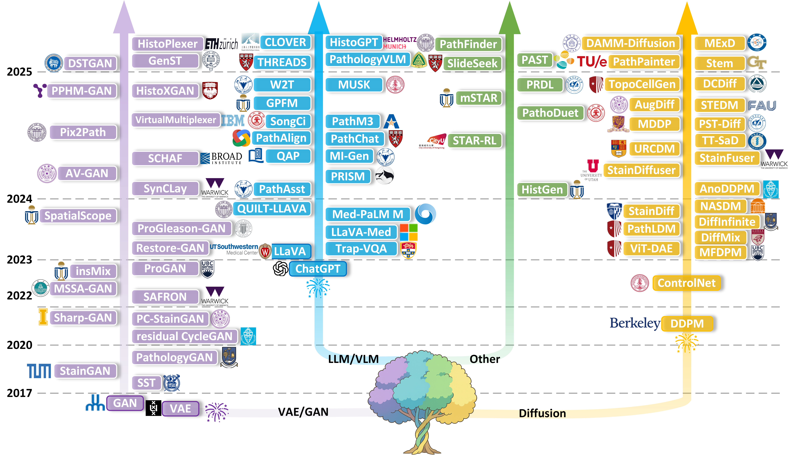
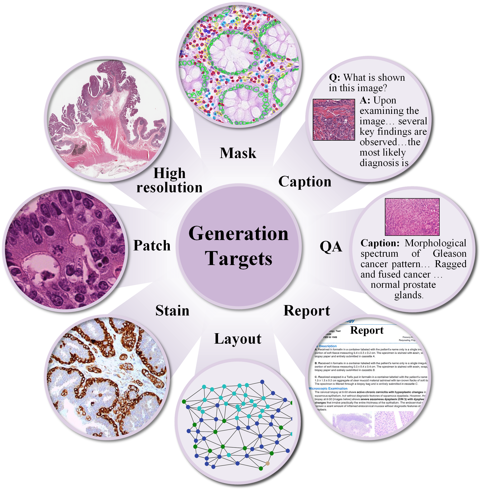

<p align="center">
  <a href="https://arxiv.org/abs/2505.10993">
    
  </a>
  <br>
  <span align="center">
    <a href="https://arxiv.org/abs/2505.10993"></a>
    &nbsp;&nbsp;
    <a href="https://www.embs.org/rbme/"></a>
    &nbsp;&nbsp;
    <a href="https://github.com/yuanzhang7/Awesome-Generative-Models-in-Pathology/"></a>
    &nbsp;&nbsp;
    <!-- 新增微信群徽章 -->
    <a href="./figures/wechat_qrcode.jpg">
      
    </a>
  </span>
</p>
📢 Scan the QR code to join our Generative Pathology WeChat group!


## ⚡ News: 

- **[29/09/2025] 🎉 Our survey has been accepted by [IEEE Reviews in Biomedical Engineering (RBME)](https://arxiv.org/abs/2505.10993)! Cheers！**
- **[16/05/2025] 📖 Our survey is available on [arXiv](https://arxiv.org/abs/2505.10993).**

## 😊 Citation
If you find this work helpful, please ⭐ star this repo or cite our survey — your support means the world to us! 🚀💖
```
@misc{zhang2025generativemodelscomputationalpathology,
      title={Content Generation Models in Computational Pathology: A Comprehensive Survey on Methods, Applications, and Challenges}, 
      author={Yuan Zhang and Xinfeng Zhang and Xiaoming Qi and Xinyu Wu and Feng Chen and Guanyu Yang and Huazhu Fu},
      year={2025},
      eprint={2505.10993},
      archivePrefix={arXiv},
      primaryClass={eess.IV},
      url={https://arxiv.org/abs/2505.10993}, 
}

```
*Note: The volume, number, pages, and DOI will be updated upon final publication.*

<!-- ## 📌 What is This Survey About?
🧬 Generative Models in Computational Pathology
Generative modeling is transforming the landscape of computational pathology, enabling data-efficient learning, synthetic data augmentation, and multimodal representation across a wide range of diagnostic tasks. This repository presents a comprehensive and structured survey of over 150 representative studies in the field, covering:

🖼️ Image Generation

📝 Text Generation

🔀 Multimodal Image–Text Generation

🧭 Other Applications (e.g., spatial simulation, molecular inference)

We trace the evolution of generative architectures, from early GANs to state-of-the-art diffusion models and foundation models, and provide commonly used datasets and evaluation metrics in generative pathology.In addition, we discuss open challenges and future directions. 

This project aims to serve as a foundational reference and open knowledge base for researchers, engineers, and clinicians working at the intersection of AI and pathology. -->

## 📌 Our Contribution

<!-- <table>
<tr>
<td width="65%" valign="top"> -->


We explore content generation modeling in the field of computational pathology — using generative models to create images, text, and molecular data that can help improve diagnostic tasks.

Our work organizes recent progress into four key areas:

🖼️ Image Generation – from tissue patches to whole-slide images

📝 Text Generation – clinical report synthesis and captioning

🧬 Molecular Profile ↔ Morphology – cross-modality generation

💎 Other Generation – tailored applications for pathology research

By reviewing 150+ representative studies, we trace the development of generation models — from GANs to diffusion models and vision–language models — and summarize available datasets, evaluation methods, and current challenges.

🎯 Goal: Provide researchers & practitioners with a reference roadmap for building more integrated, clinically applicable generation systems in computational pathology.

💡 The Landscape at a Glance
**Evolution of Generative Models (2017-2025)**
*A timeline illustrating the major milestones and developmental trajectory of generative models in pathology.*
<p align="center">
  
</p>

<!-- **Content generation modeling** has emerged as a promising direction in **computational pathology**, offering capabilities such as data-efficient learning, synthetic data augmentation, and task-oriented generation across diverse diagnostic tasks. This review provides a comprehensive synthesis of recent progress in the field, organized into four key domains: **image generation, text generation, molecular profile-morphology generation, and other specialized generation applications**. By analyzing **over 150 representative studies**, we trace the evolution of content generation architectures—from early generative adversarial networks to recent advances in diffusion models and generative vision-language models. We further examine the datasets and evaluation protocols commonly used in this domain and highlight ongoing limitations, including challenges in generating high-fidelity whole slide images, clinical interpretability, and concerns related to the ethical and legal implications of synthetic data. The review concludes with a discussion of **open challenges and prospective research directions**, with an emphasis on developing integrated and clinically deployable generation systems. This work aims to provide a foundational reference for researchers and practitioners developing content generation models in computational pathology. -->

<!-- </td>
<td width="35%" valign="top">
  <p align="center">
    
  </p>
</td>
</tr>
</table> -->

<!-- ## 💡 The Landscape at a Glance
**Evolution of Generative Models (2017-2025)**
*A timeline illustrating the major milestones and developmental trajectory of generative models in pathology.*
<p align="center">
  
</p> -->

## 📖 Structure & Taxonomy Overview

This repository provides a comprehensive and continuously updated list of over 150 papers discussed in our survey. The structure below follows the taxonomy proposed in our paper.

- [**📚 Generative Pathology Paper List**](#-generative-pathology-paper-list)
  - 🖼️ [Image Generation](#image-generation)
    - [Synthetic Image & Augmentation](#synthetic-image--augmentation)
    - [Mask-Guided Generation](#mask-guided-generation)
    - [Artifact Restoration](#artifact-restoration)
    - [High/Multi-Resolution Generation](#highmulti-resolution-generation)
    - [Text-to-Image Generation](#text-to-image-generation)
    - [Stain Synthesis (Normalization & Transfer)](#stain-synthesis-normalization--transfer)
  - [**📝 Text Generation**](#text-generation)
    - [Image Captioning](#image-captioning)
    - [Visual Question Answering (VQA)](#visual-question-answering-vqa)
    - [Report Generation](#report-generation)
    - [Report Abstraction](#report-abstraction)
  - [**🧬 Molecular Profiles-Morphology Generation**](#molecular-profiles-morphology-generation)
    - [Virtual Molecular Profiling](#virtual-molecular-profiling)
    - [Reverse Morphology Generation](#reverse-morphology-generation)
  - [**🧭 Other Generations**](#other-specialized-generations)
    - [Spatial Layout Generation](#spatial-layout-generation)
    - [Semantic Output Generation](#semantic-output-generation)
    - [Latent Representation Generation](#latent-representation-generation)
    - [Cell Simulation](#cell-simulation)

## 📚 Generative Pathology Paper List

### 🖼️ Image Generation 
*Models and methods focused on the synthesis and manipulation of histopathology images.*

#### Synthetic Image & Augmentation
- Selective synthetic augmentation with HistoGAN for improved histopathology image classification, <ins>MIA, 2020</ins> [[Paper](https://www.sciencedirect.com/science/article/pii/S1361841520301808)]
- PathologyGAN: Learning deep representations of cancer tissue, <ins>MIDL, 2020</ins> [[Paper](https://arxiv.org/abs/1907.02644)]
- Self-supervised representation learning using visual field expansion on digital pathology, <ins>ICCV, 2021</ins> [[Paper](https://openaccess.thecvf.com/content/ICCV2021W/CDPath/html/Boyd_Self-Supervised_Representation_Learning_Using_Visual_Field_Expansion_on_Digital_Pathology_ICCVW_2021_paper.html)] [[Code](https://github.com/jcboyd/cdpath21-gan)]
- InsMix: Towards Realistic Generative Data Augmentation for Nuclei Instance Segmentation, <ins>MICCAI, 2022</ins> [[Paper](https://link.springer.com/chapter/10.1007/978-3-031-16434-7_14)] [[Code](https://github.com/hust-linyi/insmix)]
- Multi-scale self-attention generative adversarial network for pathology image restoration, <ins>The Visual Computer, 2022</ins> [[Paper](https://link.springer.com/article/10.1007/s00371-022-02592-1)]
- Tackling stain variability using CycleGAN-based stain augmentation, <ins>Journal of Pathology Informatics, 2022</ins> [[Paper](https://www.sciencedirect.com/science/article/pii/S2153353922007349)]
- ProGleason-GAN: Conditional progressive growing GAN for prostatic cancer Gleason grade patch synthesis, <ins>CMPB, 2023</ins> [[Paper](https://www.sciencedirect.com/science/article/pii/S0169260723003607)] [[Code](https://github.com/cvblab/ProGleason-GAN/blob/main/train.py)]
- Diffusion-Based Data Augmentation for Nuclei Image Segmentation, <ins>MICCAI, 2023</ins> [[Paper](https://link.springer.com/chapter/10.1007/978-3-031-43993-3_57)] [[Code](https://github.com/xinyiyu/Nudiff)]
- DiffMix: Diffusion Model-Based Data Synthesis for Nuclei Segmentation and Classification in Imbalanced Pathology Image Datasets, <ins>MICCAI, 2023</ins> [[Paper](https://link.springer.com/chapter/10.1007/978-3-031-43898-1_33)] [[Code](https://github.com/hvcl/DiffMix)]
- Enhancing gland segmentation in colon histology images using an instance-aware diffusion model, <ins>CBM, 2023</ins> [[Paper](https://www.sciencedirect.com/science/article/pii/S0010482523009927)]
- A Morphology Focused Diffusion Probabilistic Model for Synthesis of Histopathology Images, <ins>WACV, 2023</ins> [[Paper](https://openaccess.thecvf.com/content/WACV2023/html/Moghadam_A_Morphology_Focused_Diffusion_Probabilistic_Model_for_Synthesis_of_Histopathology_WACV_2023_paper.html)]
- Unified Framework for Histopathology Image Augmentation and Classification via Generative Models, <ins>DICTA, 2024</ins> [[Paper](https://ieeexplore.ieee.org/document/10869588)]
- ViT-DAE: Transformer-Driven Diffusion Autoencoder for Histopathology Image Analysis, <ins>MICCAI Workshop, 2024</ins> [[Paper](https://link.springer.com/chapter/10.1007/978-3-031-53767-7_7)]
- USegMix: Unsupervised Segment Mix for Efficient Data Augmentation in Pathology Images, <ins>DEMI, 2024</ins> [[Paper](https://link.springer.com/chapter/10.1007/978-3-031-73748-0_6)]
- Learned representation-guided diffusion models for large-image generation, <ins>CVPR, 2024</ins> [[Paper](https://openaccess.thecvf.com/content/CVPR2024/html/Graikos_Learned_Representation-Guided_Diffusion_Models_for_Large-Image_Generation_CVPR_2024_paper.html)] [[Code](https://github.com/cvlab-stonybrook/Large-Image-Diffusion)]
- Generating progressive images from pathological transitions via diffusion model, <ins>MICCAI, 2024</ins> [[Paper](https://link.springer.com/chapter/10.1007/978-3-031-72120-5_29)] [[Code](https://github.com/Rowerliu/ADD)]
- Characterizing the Features of Mitotic Figures Using a Conditional Diffusion Probabilistic Model, <ins>MICCAI Workshop, 2024</ins> [[Paper](https://link.springer.com/chapter/10.1007/978-3-031-53767-7_12)] [[Code](https://github.com/cagladbahadir/dpm-for-mitotic-figures)]
- Optimising diffusion models for histopathology image synthesis, <ins>BMVC, 2024</ins> [[Paper](https://pure.qub.ac.uk/en/publications/optimising-diffusion-models-for-histopathology-image-synthesis)]
- Counterfactual Diffusion Models for Mechanistic Explainability of Artificial Intelligence Models in Pathology, <ins>bioRxiv, 2024</ins> [[Paper](https://www.biorxiv.org/content/10.1101/2024.10.29.620913v3)] [[Code](https://github.com/KatherLab/mopadi?tab=readme-ov-file)]
- Diffusion models for out-of-distribution detection in digital pathology, <ins>MIA, 2024</ins> [[Paper](https://www.sciencedirect.com/science/article/pii/S1361841524000136)]
- Deep Learning for Automated Detection of Breast Cancer in Deep Ultraviolet Fluorescence Images with Diffusion Probabilistic Model, <ins>ISBI, 2024</ins> [[Paper](https://ieeexplore.ieee.org/document/10635349)]
- Generative models improve fairness of medical classifiers under distribution shifts, <ins>Nature Medicine, 2024</ins> [[Paper](https://www.nature.com/articles/s41591-024-02838-6)]
- Generating and evaluating synthetic data in digital pathology through diffusion models, <ins>Scientific Reports, 2024</ins> [[Paper](https://www.nature.com/articles/s41598-024-79602-w)] [[Code](https://github.com/Mat-Po/diffusion_digital_pathology?tab=readme-ov-file)]
- Mitigating bias in prostate cancer diagnosis using synthetic data for improved AI driven Gleason grading, <ins>npj Precision Oncology, 2025</ins> [[Paper](https://www.nature.com/articles/s41698-025-00934-5)]
- Prototype-Guided Diffusion for Digital Pathology: Achieving Foundation Model Performance with Minimal Clinical Data, <ins>CVPR, 2025</ins> [[Paper](https://openaccess.thecvf.com/content/CVPR2025W/NeXD/html/Redekop_Prototype-Guided_Diffusion_for_Digital_Pathology_Achieving_Foundation_Model_Performance_with_CVPRW_2025_paper.html)]
- PDSeg: Patch-Wise Distillation and Controllable Image Generation for Weakly-Supervised Histopathology Tissue Segmentation, <ins>ICASSP, 2025</ins> [[Paper](https://ieeexplore.ieee.org/document/10888097)] [[Code](https://github.com/AI-Application-and-Integration-Lab/PDSeg)]

#### Mask-Guided Generation
- A multi-attribute controllable generative model for histopathology image synthesis, <ins>MICCAI, 2021</ins> [[Paper](https://link.springer.com/chapter/10.1007/978-3-030-87237-3_59)] [[Code](https://github.com/karenyyy/MICCAI2021_AttributeGAN)]
- Sharp-gan: Sharpness loss regularized gan for histopathology image synthesis, <ins>ISBI, 2022</ins> [[Paper](https://ieeexplore.ieee.org/abstract/document/9761534)]
- Realistic data enrichment for robust image segmentation in histopathology, <ins>MICCAI Workshop, 2023</ins> [[Paper](https://link.springer.com/chapter/10.1007/978-3-031-45857-6_7)]
- NASDM: Nuclei-Aware Semantic Histopathology Image Generation Using Diffusion Models, <ins>MICCAI, 2023</ins> [[Paper](https://link.springer.com/chapter/10.1007/978-3-031-43987-2_76)] [[Code](https://github.com/4m4n5/NASDM)]
- DiffInfinite: Large Mask-Image Synthesis via Parallel Random Patch Diffusion in Histopathology, <ins>NeurIPS, 2023</ins> [[Paper](https://proceedings.neurips.cc/paper_files/paper/2023/hash/f64927f5de00c47899e6e58c731966b6-Abstract-Datasets_and_Benchmarks.html)] [[Code](https://github.com/marcoaversa/diffinfinite)]
- DISC: Latent Diffusion Models with Self-Distillation from Separated Conditions for Prostate Cancer Grading, <ins>ISBI, 2024</ins> [[Paper](https://ieeexplore.ieee.org/abstract/document/10635191)]
- Style-Extracting Diffusion Models for Semi-supervised Histopathology Segmentation, <ins>ECCV, 2024</ins> [[Paper](https://link.springer.com/chapter/10.1007/978-3-031-73226-3_14#citeas)] [[Code](https://github.com/OettlM/STEDM)]
- Co-synthesis of Histopathology Nuclei Image-Label Pairs using a Context-Conditioned Joint Diffusion Model, <ins>ECCV, 2024</ins> [[Paper](https://link.springer.com/chapter/10.1007/978-3-031-72624-8_9)] [[Code](https://github.com/hvcl/CoSyn-ContextCondNucAug)]
- SynCLay: Interactive synthesis of histology images from bespoke cellular layouts, <ins>MIA, 2024</ins> [[Paper](https://www.sciencedirect.com/science/article/pii/S1361841523002554)]
- HADiff: hierarchy aggregated diffusion model for pathology image segmentation, <ins>The Visual Computer, 2025</ins> [[Paper](https://doi.org/10.1007/s00371-024-03746-z)]
- Mask-guided cross-image attention for zero-shot in-silico histopathologic image generation with a diffusion model, <ins>arXiv, 2025</ins> [[Paper](https://arxiv.org/abs/2407.11664)]
- PathoPainter: Augmenting Histopathology Segmentation via Tumor-aware Inpainting, <ins>MICCAI, 2025</ins> [[Paper](https://link.springer.com/chapter/10.1007/978-3-032-05325-1_39)] [[Code](https://github.com/HongLiuuuuu/PathoPainter)]
- A robust image segmentation and synthesis pipeline for histopathology, <ins>MIA, 2025</ins> [[Paper](https://www.sciencedirect.com/science/article/pii/S136184152400269X)] [[Code](https://github.com/DeepMIALab/PathoSeg)]

#### Artifact Restoration
- A review of artifacts in histopathology, <ins>J Oral Maxillofac Pathol., 2018</ins> [[Paper](https://journals.lww.com/jpat/fulltext/2018/22020/a_review_of_artifacts_in_histopathology.26.aspx)]
- Restoration of Marker Occluded Hematoxylin and Eosin Stained Whole Slide Histology Images Using Generative Adversarial Networks, <ins>ISBI, 2020</ins> [[Paper](https://ieeexplore.ieee.org/abstract/document/9098358)]
- Multi-scale self-attention generative adversarial network for pathology image restoration, <ins>The Visual Computer, 2022</ins> [[Paper](https://link.springer.com/article/10.1007/s00371-022-02592-1)]
- Artifact Detection and Restoration in Histology Images With Stain-Style and Structural Preservation, <ins>TMI, 2023</ins> [[Paper](https://ieeexplore.ieee.org/document/10160043)] [[Code](https://github.com/yunboer/AR-classifier-and-AR-CycleGAN)]
- Artifact Restoration in Histology Images with Diffusion Probabilistic Models, <ins>MICCAI, 2023</ins> [[Paper](https://link.springer.com/chapter/10.1007/978-3-031-43987-2_50)] [[Code](https://github.com/zhenqi-he/ArtiFusion)]
- Enhanced Pathology Image Quality with Restore–Generative Adversarial Network, <ins>The American Journal of Pathology, 2023</ins> [[Paper](https://www.sciencedirect.com/science/article/pii/S0002944023000275)]
- A Federated Learning System for Histopathology Image Analysis With an Orchestral Stain-Normalization GAN, <ins>TMI, 2023</ins> [[Paper](https://ieeexplore.ieee.org/document/9947057)]
- Histology Image Artifact Restoration with Lightweight Transformer Based Diffusion Model, <ins>AIME, 2024</ins> [[Paper](https://link.springer.com/chapter/10.1007/978-3-031-66535-6_9)]
- LatentArtiFusion: An Effective and Efficient Histological Artifacts Restoration Framework, <ins>MICCAI Workshop, 2024</ins> [[Paper](https://arxiv.org/abs/2407.20172)] [[Code](https://github.com/bugs-creator/LatentArtiFusion)]
- HARP: Unsupervised histopathology artifact restoration, <ins>MIDL, 2024</ins> [[Paper](https://openreview.net/forum?id=bVunbe4hoV)] [[Code](https://github.com/MECLabTUDA/HARP)]
- ArtiDiffuser: A unified framework for artifact restoration and synthesis for histology images via counterfactual diffusion model, <ins>MIA, 2025</ins> [[Paper](https://www.sciencedirect.com/science/article/abs/pii/S1361841525001148)] [[Code](https://github.com/wagnchogn/ArtiDiffuser)]

#### High/Multi-Resolution Generation
- Synthesis of diagnostic quality cancer pathology images by generative adversarial networks, <ins>The Journal of Pathology, 2020</ins> [[Paper](https://pathsocjournals.onlinelibrary.wiley.com/doi/abs/10.1002/path.5509)] [[Code](https://github.com/AIMLab-UBC/pathGAN)]
- Self-supervised representation learning using visual field expansion on digital pathology, <ins>ICCV, 2021</ins> [[Paper](https://openaccess.thecvf.com/content/ICCV2021W/CDPath/html/Boyd_Self-Supervised_Representation_Learning_Using_Visual_Field_Expansion_on_Digital_Pathology_ICCVW_2021_paper.html)] [[Code](https://github.com/jcboyd/cdpath21-gan)]
- Seamless Virtual Whole Slide Image Synthesis and Validation Using Perceptual Embedding Consistency, <ins>JBHI, 2021</ins> [[Paper](https://ieeexplore.ieee.org/document/9003176)]
- SAFRON: stitching across the frontier network for generating colorectal cancer histology images, <ins>MIA, 2022</ins> [[Paper](https://www.sciencedirect.com/science/article/abs/pii/S1361841521003820)] [[Code](https://github.com/Srijay/SAFRON)]
- Diffusion-based generation of Histopathological Whole Slide Images at a Gigapixel scale, <ins>WACV, 2024</ins> [[Paper](https://openaccess.thecvf.com/content/WACV2024/html/Harb_Diffusion-Based_Generation_of_Histopathological_Whole_Slide_Images_at_a_Gigapixel_WACV_2024_paper.html)]
- URCDM: Ultra-Resolution Image Synthesis in Histopathology, <ins>MICCAI, 2024</ins> [[Paper](https://link.springer.com/chapter/10.1007/978-3-031-72083-3_50)] [[Code](https://github.com/scechnicka/URCDM)]
- Histo-Diffusion: A Diffusion Super-Resolution Method for Digital Pathology with Comprehensive Quality Assessment, <ins>arXiv, 2024</ins> [[Paper](https://arxiv.org/abs/2408.15218)]
- PathUp: Patch-wise Timestep Tracking for Multi-class Large Pathology Image Synthesising Diffusion Model, <ins>MM '24, 2024</ins> [[Paper](https://dl.acm.org/doi/10.1145/3664647.3681295)]
- STAR-RL: Spatial-Temporal Hierarchical Reinforcement Learning for Interpretable Pathology Image Super-Resolution, <ins>TMI, 2024</ins> [[Paper](https://ieeexplore.ieee.org/document/10574839)] [[Code](https://github.com/CUHK-AIM-Group/STAR-RL)]
- Comparative Analysis of Diffusion Generative Models in Computational Pathology, <ins>arXiv, 2024</ins> [[Paper](https://arxiv.org/abs/2411.15719)]
- ToPoFM: Topology-Guided Pathology Foundation Model for High-Resolution Pathology Image Synthesis with Cellular-Level Control, <ins>TMI, 2025</ins> [[Paper](https://ieeexplore.ieee.org/document/10915718)]

#### Text-to-Image Generation
- PathLDM: Text conditioned Latent Diffusion Model for Histopathology, <ins>WACV, 2024</ins> [[Paper](https://openaccess.thecvf.com/content/WACV2024/html/Yellapragada_PathLDM_Text_Conditioned_Latent_Diffusion_Model_for_Histopathology_WACV_2024_paper.html)] [[Code](https://github.com/cvlab-stonybrook/PathLDM)]
- VIMs: Virtual Immunohistochemistry Multiplex Staining via Text-to-Stain Diffusion Trained on Uniplex Stains, <ins>MLMI, 2024</ins> [[Paper](https://link.springer.com/chapter/10.1007/978-3-031-73284-3_15)]

#### Stain Synthesis (Normalization & Transfer)
- Neural Stain-Style Transfer Learning using GAN for Histopathological Images, <ins>arXiv, 2017</ins> [[Paper](https://arxiv.org/abs/1710.08543)] [[Code](https://github.com/hw-liang/DSCSI-GAN)]
- Stain normalization of histopathology images using generative adversarial networks, <ins>ISBI, 2018</ins> [[Paper](https://ieeexplore.ieee.org/abstract/document/8363641)]
- Normalization of HE-stained histological images using cycle consistent generative adversarial networks, <ins>Diagnostic Pathology, 2021</ins> [[Paper](https://diagnosticpathology.biomedcentral.com/articles/10.1186/s13000-021-01126-y)]
- Residual cyclegan for robust domain transformation of histopathological tissue slides, <ins>MIA, 2021</ins> [[Paper](https://www.sciencedirect.com/science/article/pii/S1361841521000505)] [[Code](https://github.com/computationalpathologygroup/pathology-cyclegan-stain-transformation)]
- Unpaired Stain Transfer Using Pathology-Consistent Constrained Generative Adversarial Networks, <ins>TMI, 2021</ins> [[Paper](https://ieeexplore.ieee.org/document/9389763)] [[Code](https://github.com/Pathology-Consistent-Stain-Transfer/Unpaired-Stain-Transfer-using-Pathology-Consistent-Constrained-Generative-Adversarial-Networks)]
- Seamless Virtual Whole Slide Image Synthesis and Validation Using Perceptual Embedding Consistency, <ins>JBHI, 2021</ins> [[Paper](https://ieeexplore.ieee.org/document/9003176)]
- Colour adaptive generative networks for stain normalisation of histopathology images, <ins>MIA, 2022</ins> [[Paper](https://www.sciencedirect.com/science/article/abs/pii/S1361841522002195)] [[Code](https://github.com/thomascong121/CAGAN_Stain_Norm)]
- A Federated Learning System for Histopathology Image Analysis With an Orchestral Stain-Normalization GAN, <ins>TMI, 2023</ins> [[Paper](https://ieeexplore.ieee.org/document/9947057)]
- Stain normalization using score-based diffusion model through stain separation and overlapped moving window patch strategies, <ins>CBM, 2023</ins> [[Paper](https://www.sciencedirect.com/science/article/pii/S0010482522010435)]
- StainDiff: Transfer Stain Styles of Histology Images with Denoising Diffusion Probabilistic Models and Self-ensemble, <ins>MICCAI, 2023</ins> [[Paper](https://link.springer.com/chapter/10.1007/978-3-031-43987-2_53)]
- Generative adversarial networks for stain normalisation in histopathology, <ins>Applications of Generative AI, 2024</ins> [[Paper](https://link.springer.com/chapter/10.1007/978-3-031-46238-2_11)]
- StainFuser: Controlling Diffusion for Faster Neural Style Transfer in Multi-Gigapixel Histology Images, <ins>arXiv, 2024</ins> [[Paper](https://arxiv.org/abs/2403.09302)] [[Code](https://github.com/R-J96/stainFuser)]
- Test-Time Stain Adaptation with Diffusion Models for Histopathology Image Classification, <ins>ECCV, 2024</ins> [[Paper](https://link.springer.com/chapter/10.1007/978-3-031-72761-0_15)] [[Code](https://github.com/cctsai831/TT-SaD)]
- Unsupervised Latent Stain Adaptation for Computational Pathology, <ins>MICCAI, 2024</ins> [[Paper](https://papers.miccai.org/miccai-2024/820-Paper2012.html)]
- Accelerating histopathology workflows with generative AI-based virtually multiplexed tumour profiling, <ins>Nature Machine Intelligence, 2024</ins> [[Paper](https://www.nature.com/articles/s42256-024-00889-5)] [[Code](https://github.com/AI4SCR/VirtualMultiplexer)]
- Virtual multi-staining in a single-section view for renal pathology using generative adversarial networks, <ins>CBM, 2024</ins> [[Paper](https://www.sciencedirect.com/science/article/pii/S0010482524012344)]
- AV-GAN: Attention-Based Varifocal Generative Adversarial Network for Uneven Medical Image Translation, <ins>IJCNN, 2024</ins> [[Paper](https://ieeexplore.ieee.org/document/10649902)]
- Diffusion Models for Generative Histopathology, <ins>MICCAI Workshop, 2024</ins> [[Paper](https://link.springer.com/chapter/10.1007/978-3-031-53767-7_15)]
- PST-Diff: Achieving High-Consistency Stain Transfer by Diffusion Models With Pathological and Structural Constraints, <ins>TMI, 2024</ins> [[Paper](https://ieeexplore.ieee.org/document/10601703)]
- StainDiffuser: MultiTask Dual Diffusion Model for Virtual Staining, <ins>arXiv, 2024</ins> [[Paper](https://arxiv.org/abs/2403.11340)]
- Multi-modal Denoising Diffusion Pre-training for Whole-Slide Image Classification, <ins>MM '24, 2024</ins> [[Paper](https://dl.acm.org/doi/10.1145/3664647.3680882)] [[Code](https://github.com/lhaof/MDDP)]
- Deeply supervised two stage generative adversarial network for stain normalization, <ins>Scientific Reports, 2025</ins> [[Paper](https://www.nature.com/articles/s41598-025-91587-8)]
- ODA-GAN: Orthogonal Decoupling Alignment GAN Assisted by Weakly-supervised Learning for Virtual Immunohistochemistry Staining, <ins>CVPR, 2025</ins> [[Paper](https://ieeexplore.ieee.org/document/11095140)] [[Code](https://github.com/ittong/ODA-GAN)]
- A Value Mapping Virtual Staining Framework for Large-scale Histological Imaging, <ins>arXiv, 2025</ins> [[Paper](https://arxiv.org/abs/2501.03592)]
- Diffusion-based Virtual Staining from Polarimetric Mueller Matrix Imaging, <ins>MICCAI, 2025</ins> [[Paper](https://link.springer.com/chapter/10.1007/978-3-032-04927-8_16)]
- F2FLDM: Latent Diffusion Models with Histopathology Pre-Trained Embeddings for Unpaired Frozen Section to FFPE Translation, <ins>WACV, 2025</ins> [[Paper](https://ieeexplore.ieee.org/abstract/document/10943340)] [[Code](https://github.com/minhmanho/f2f_ldm)]
- Unpaired Multi-Domain Histopathology Virtual Staining Using Dual Path Prompted Inversion, <ins>AAAI, 2025</ins> [[Paper](https://ojs.aaai.org/index.php/AAAI/article/view/32949)] [[Code](https://github.com/DianaNerualNetwork/StainPromptInversion)]
- Versatile Stain Transfer in Histopathology Using a Unified Diffusion Framework, <ins>ISBI, 2025</ins> [[Paper](https://ieeexplore.ieee.org/document/10980971)]

---
### 📝 Text Generation
*This category covers models that generate text from pathology images, such as captions or reports.*

#### Image Captioning
- Multiple Instance Captioning: Learning Representations from Histopathology Textbooks and Articles, <ins>CVPR, 2021</ins> [[Paper](https://ieeexplore.ieee.org/document/9577950)] [[Code](https://github.com/GeorgeBatch/arch-pre-training)]
- Inference of captions from histopathological patches, <ins>MIDL, 2022</ins> [[Paper](https://openreview.net/forum?id=9gKn7SDb83v)] [[Code](https://github.com/masatsuneki/histopathology-image-caption)]
- Enhanced descriptive captioning model for histopathological patches, <ins>Multimedia Tools and Applications, 2023</ins> [[Paper](https://link.springer.com/article/10.1007/s11042-023-15884-y)]
- What a Whole Slide Image Can Tell? Subtype-guided Masked Transformer for Pathological Image Captioning, <ins>arXiv, 2023</ins> [[Paper](https://arxiv.org/abs/2310.20607)]
- PathM3: A Multimodal Multi-task Multiple Instance Learning Framework for Whole Slide Image Classification and Captioning, <ins>MICCAI, 2024</ins> [[Paper](https://link.springer.com/chapter/10.1007/978-3-031-72083-3_35)]
- HistGen: Histopathology Report Generation via Local-Global Feature Encoding and Cross-Modal Context Interaction, <ins>MICCAI, 2024</ins> [[Paper](https://link.springer.com/chapter/10.1007/978-3-031-72083-3_18)] [[Code](https://github.com/dddavid4real/HistGen)]
- In-context learning enables multimodal large language models to classify cancer pathology images, <ins>Nature Communications, 2024</ins> [[Paper](https://doi.org/10.1038/s41467-024-51465-9)]

#### Visual Question Answering (VQA)
- PathVQA: 30000+ Questions for Medical Visual Question Answering, <ins>arXiv preprint, 2020</ins> [[Paper](https://arxiv.org/abs/2003.10286)] [[Code](https://github.com/KaveeshaSIlva/PathVQA)]
- Vision-Language Transformer for Interpretable Pathology Visual Question Answering, <ins>JBHI, 2023</ins> [[Paper](https://ieeexplore.ieee.org/document/9745795)]
- WSI-VQA: Interpreting Whole Slide Images by Generative Visual Question Answering, <ins>ECCV, 2024</ins> [[Paper](https://link.springer.com/chapter/10.1007/978-3-031-72764-1_23)] [[Code](https://github.com/cpystan/WSI-VQA)]
- A multimodal generative AI copilot for human pathology, <ins>Nature, 2024</ins> [[Paper](https://www.nature.com/articles/s41586-024-07618-3)]
- Quilt-LLaVA: Visual Instruction Tuning by Extracting Localized Narratives from Open-Source Histopathology Videos, <ins>CVPR, 2024</ins> [[Paper](https://openaccess.thecvf.com/content/CVPR2024/html/Seyfioglu_Quilt-LLaVA_Visual_Instruction_Tuning_by_Extracting_Localized_Narratives_from_Open-Source_CVPR_2024_paper.html)] [[Code](https://github.com/aldraus/quilt-llava)]
- A vision–language foundation model for precision oncology, <ins>Nature, 2025</ins> [[Paper](https://doi.org/10.1038/s41586-024-08378-w)]
- PathGen-1.6M: 1.6 Million Pathology Image-text Pairs Generation through Multi-agent Collaboration, <ins>ICLR, 2025</ins> [[Paper](https://openreview.net/forum?id=rFpZnn11gj)] [[Code](https://github.com/PathFoundation/PathGen-1.6M)]
- Pathologyvlm: a large vision-language model for pathology image understanding, <ins>Artificial Intelligence Review, 2025</ins> [[Paper](https://doi.org/10.1007/s10462-025-11190-1)]
- SlideChat: A Large Vision-Language Assistant for Whole-Slide Pathology Image Understanding, <ins>CVPR, 2025</ins> [[Paper](https://openaccess.thecvf.com/content/CVPR2025/html/Chen_SlideChat_A_Large_Vision-Language_Assistant_for_Whole-Slide_Pathology_Image_Understanding_CVPR_2025_paper.html)] [[Code](https://github.com/uni-medical/SlideChat)]
- PathCoT: Chain-of-Thought Prompting for Zero-shot Pathology Visual Reasoning, <ins>arxiv, 2025</ins> [[Paper](https://arxiv.org/abs/2507.01029)]
- Cost-effective instruction learning for pathology vision and language analysis, <ins>Nature Computational Science, 2025</ins> [[Paper](https://www.nature.com/articles/s43588-025-00818-5)] [[Code](https://github.com/JLINEkai/CLOVER)]
- Efficient Whole Slide Pathology VQA via Token Compression, <ins>arxiv, 2025</ins> [[Paper](https://arxiv.org/abs/2507.14497v2)]

#### Report Generation
- PRISM: A Multi-Modal Generative Foundation Model for Slide-Level Histopathology, <ins>arXiv, 2024</ins> [[Paper](https://arxiv.org/abs/2405.10254)] [[Code](https://huggingface.co/paige-ai/Prism)]
- Automatic Report Generation for Histopathology images using pre-trained Vision Transformers and BERT, <ins>ISBI, 2024</ins> [[Paper](https://ieeexplore.ieee.org/abstract/document/10635175)]
- Generating dermatopathology reports from gigapixel whole slide images with HistoGPT, <ins>Nature Communications, 2024</ins> [[Paper](https://www.nature.com/articles/s41467-025-60014-x)] [[Code](https://github.com/marrlab/HistoGPT)]
- A Multimodal Knowledge-enhanced Whole-slide Pathology Foundation Model, <ins>arXiv, 2024</ins> [[Paper](https://arxiv.org/abs/2407.15362)] [[Code](https://github.com/Innse/mSTAR)]
- WsiCaption: Multiple Instance Generation of Pathology Reports for Gigapixel Whole-Slide Images, <ins>MICCAI, 2024</ins> [[Paper](https://link.springer.com/chapter/10.1007/978-3-031-72083-3_51)] [[Code](https://github.com/cpystan/Wsi-Caption)]
- PathAlign: A vision-language model for whole slide images in histopathology, <ins>MICCAI, 2024</ins> [[Paper](https://proceedings.mlr.press/v254/ahmed24a)]
- PathInsight: Instruction Tuning of Multimodal Datasets and Models for Intelligence Assisted Diagnosis in Histopathology, <ins>arXiv, 2024</ins> [[Paper](https://arxiv.org/abs/2408.07037)]
- Pathology report generation from whole slide images with knowledge retrieval and multi-level regional feature selection, <ins>CMPB, 2025</ins> [[Paper](https://www.sciencedirect.com/science/article/pii/S016926072500094X)]
- Pathfinder: A multi-modal multi-agent system for medical diagnostic decision-making applied to histopathology, <ins>arXiv, 2025</ins> [[Paper](https://arxiv.org/abs/2502.08916)]
- Pathology Report Generation and Multimodal Representation Learning for Cutaneous Melanocytic Lesions, <ins>arXiv, 2025</ins> [[Paper](https://arxiv.org/abs/2502.19293)]
- PolyPath: Adapting a Large Multimodal Model for Multi-slide Pathology Report Generation, <ins>arXiv, 2025</ins> [[Paper](https://arxiv.org/abs/2502.10536)]

#### Report Abstraction
- Using Generative AI to Extract Structured Information from Free Text Pathology Reports, <ins>Journal of Medical Systems, 2025</ins> [[Paper](https://link.springer.com/article/10.1007/s10916-025-02167-2)]
- Leveraging large language models for structured information extraction from pathology reports, <ins>arXiv, 2025</ins> [[Paper](https://arxiv.org/abs/2502.12183)]
- Cancer Type, Stage and Prognosis Assessment from Pathology Reports using LLMs, <ins>Scientific Reports, 2025</ins> [[Paper](https://www.nature.com/articles/s41598-025-10709-4)] [[Code](https://github.com/rachitsaluja/pathrep-bench)]
- Enhancing doctor-patient communication using large language models for pathology report interpretation, <ins>BMC Medical Informatics and Decision Making, 2025</ins> [[Paper](https://bmcmedinformdecismak.biomedcentral.com/articles/10.1186/s12911-024-02838-z)]
---
### 🧬 Molecular Profiles-Morphology Generation
*Models that bridge the gap between histology (phenotype) and genomics (genotype).*

#### Virtual Molecular Profiling
- Integrating spatial and single-cell transcriptomics data using deep generative models with SpatialScope, <ins>Nature Communications, 2023</ins> [[Paper](https://www.nature.com/articles/s41467-023-43629-w)] [[Code](https://github.com/YangLabHKUST/SpatialScope)]
- Cross-modal diffusion modelling for super-resolved spatial transcriptomics, <ins>MICCAI, 2024</ins> [[Paper](https://link.springer.com/chapter/10.1007/978-3-031-72384-1_10)]
- PAST: A multimodal single-cell foundation model for histopathology and spatial transcriptomics in cancer, <ins>arxiv, 2025</ins> [[Paper](https://arxiv.org/abs/2507.06418)]
- Inference of single cell profiles from histology stains with the Single-Cell omics from Histology Analysis Framework (SCHAF), <ins>bioRxiv, 2025</ins> [[Paper](https://www.biorxiv.org/content/10.1101/2023.03.21.533680v2)]
- GenST: A Generative Cross-Modal Model for Predicting Spatial Transcriptomics from Histology Images, <ins>MICCAI workshop, 2025</ins> [[Paper](https://openreview.net/forum?id=LHVSSaCKL6)]
- Diffusion Generative Modeling for Spatially Resolved Gene Expression Inference from Histology Images, <ins>ICLR, 2025</ins> [[Paper](https://openreview.net/forum?id=FtjLUHyZAO)] [[Code](https://github.com/SichenZhu/Stem)]
- Histopathology-based protein multiplex generation using deep learning, <ins>Nature Machine Intelligence, 2025</ins> [[Paper](https://www.nature.com/articles/s42256-025-01074-y)] [[Code](https://github.com/ratschlab/HistoPlexer)]
- Robust Multimodal Survival Prediction with Conditional Latent Differentiation Variational AutoEncoder, <ins>CVPR, 2025</ins> [[Paper](https://arxiv.org/abs/2503.09496)] [[Code](https://github.com/JJ-ZHOU-Code/RobustMultiModel)]

#### Reverse Morphology Generation
- Pix2Path: Integrating Spatial Transcriptomics and Digital Pathology with Deep Learning to Score Pathological Risk and Link Gene Expression to Disease Mechanisms, <ins>bioRxiv, 2024</ins> [[Paper](https://www.biorxiv.org/content/10.1101/2024.08.18.608468v1)] [[Code](https://github.com/frankXiaonan/Pix2Path)]
- Generation of synthetic whole-slide image tiles of tumours from RNA-sequencing data via cascaded diffusion models, <ins>Nature Biomedical Engineering, 2024</ins> [[Paper](https://www.nature.com/articles/s41551-024-01193-8)]
- Generative adversarial networks accurately reconstruct pan-cancer histology from pathologic, genomic, and radiographic latent features, <ins>Science Advances, 2024</ins> [[Paper](https://www.science.org/doi/10.1126/sciadv.adq0856)] [[Code](https://github.com/fmhoward/HistoXGAN)]
- PAST: A multimodal single-cell foundation model for histopathology and spatial transcriptomics in cancer, <ins>arxiv, 2025</ins> [[Paper](https://arxiv.org/abs/2507.06418)]
- SPATIA: Multimodal Model for Prediction and Generation of Spatial Cell Phenotypes, <ins>arxiv, 2025</ins> [[Paper](https://arxiv.org/abs/2507.04704)]

---
### 💎 Other Generations
*Emerging and specialized generative tasks beyond traditional image and text synthesis.*

#### Spatial Layout Generation
- Spatial Diffusion for Cell Layout Generation, <ins>MICCAI, 2024</ins> [[Paper](https://papers.miccai.org/miccai-2024/717-Paper2613.html)] [[Code](https://github.com/superlc1995/Diffusion-cell)]
- Tertiary Lymphoid Structures Generation Through Graph-Based Diffusion, <ins>MICCAI, 2024</ins> [[Paper](https://link.springer.com/chapter/10.1007/978-3-031-55088-1_4)]
- TopoCellGen: Generating Histopathology Cell Topology with a Diffusion Model, <ins>CVPR, 2025</ins> [[Paper](https://openaccess.thecvf.com/content/CVPR2025/html/Xu_TopoCellGen_Generating_Histopathology_Cell_Topology_with_a_Diffusion_Model_CVPR_2025_paper.html)] [[Code](https://github.com/Melon-Xu/TopoCellGen)]
- DAMM-Diffusion: Learning Divergence-Aware Multi-Modal Diffusion Model for Nanoparticles Distribution Prediction, <ins>CVPR, 2025</ins> [[Paper](https://openaccess.thecvf.com/content/CVPR2025/html/Zhou_DAMM-Diffusion_Learning_Divergence-Aware_Multi-Modal_Diffusion_Model_for_Nanoparticles_Distribution_Prediction_CVPR_2025_paper.html)] [[Code](https://github.com/JJ-ZHOU-Code/DAMM-Diffusion)]

#### Semantic Output Generation
- A visual–language foundation model for pathology image analysis using medical Twitter, <ins>Nature Medicine, 2023</ins> [[Paper](https://www.nature.com/articles/s41591-023-02504-3)] [[Code](https://github.com/PathologyFoundation/plip)]
- Prompting vision foundation models for pathology image analysis, <ins>CVPR, 2024</ins> [[Paper](https://ieeexplore.ieee.org/document/10658362)] [[Code](https://github.com/7LFB/QAP)]
- Towards a Text-Based Quantitative and Explainable Histopathology Image Analysis, <ins>MICCAI, 2024</ins> [[Paper](https://papers.miccai.org/miccai-2024/783-Paper2481.html)]
- MLLM4PUE: Toward Universal Embeddings in Digital Pathology through Multimodal LLMs, <ins>arXiv, 2025</ins> [[Paper](https://arxiv.org/abs/2502.07221)]

#### Latent Representation Generation
- AugDiff: Diffusion-Based Feature Augmentation for Multiple Instance Learning in Whole Slide Image, <ins>TAI, 2024</ins> [[Paper](https://ieeexplore.ieee.org/document/10666706)] [[Code](https://github.com/szc19990412/AugDiff)]
- A whole-slide foundation model for digital pathology from real-world data, <ins>Nature, 2024</ins> [[Paper](https://www.nature.com/articles/s41586-024-07441-w)] [[Code](https://github.com/prov-gigapath/prov-gigapath)]
- DCDiff: Dual-Granularity Cooperative Diffusion Models for Pathology Image Analysis, <ins>TMI, 2024</ins> [[Paper](https://ieeexplore.ieee.org/document/10577168)]
- Towards A Generalizable Pathology Foundation Model via Unified Knowledge Distillation, <ins>arxiv, 2024</ins> [[Paper](https://arxiv.org/abs/2407.18449)] [[Code](https://github.com/birkhoffkiki/GPFM)]
- Promptable Representation Distribution Learning and Data Augmentation for Gigapixel Histopathology WSI Analysis, <ins>AAAI, 2025</ins> [[Paper](https://ojs.aaai.org/index.php/AAAI/article/view/32779)] [[Code](https://github.com/lazytkm/PRDL)]
- MGPATH: Vision-Language Model with Multi-Granular Prompt Learning for Few-Shot WSI Classification, <ins>arxiv, 2025</ins> [[Paper](https://arxiv.org/abs/2502.07409)] [[Code](https://github.com/HauschildLab/MGPATH)]

#### Cell Simulation
- SynCellFactory: Generative Data Augmentation for Cell Tracking, <ins>MICCAI, 2024</ins> [[Paper](https://link.springer.com/chapter/10.1007/978-3-031-72390-2_29)] [[Code](https://github.com/sciai-lab/SynCellFactory)]
- Improving 3D deep learning segmentation with biophysically motivated cell synthesis, <ins>Communications Biology, 2025</ins> [[Paper](https://www.nature.com/articles/s42003-025-07469-2)] [[Code](https://github.com/bruchr/cell_synthesis)]


## 🌱 Join Our Community & Contribute

The field of Generative Pathology is evolving rapidly. This repository aims to be a living resource, and we welcome your help to keep it at the cutting edge.

### How to Contribute
We are building this resource for the community, and we welcome contributions of all sizes! Whether it's adding a new paper, providing a code link, or simply fixing a typo, every bit of help is appreciated.

You can help by:
- ✍️ Adding new papers or code links
- 📊 Fixing typos and broken links

To get started, please read our **[Contribution Guidelines](CONTRIBUTING.md)** for the full details on how to format your submission.

### Show Your Support
If you find this survey and repository helpful for your work, please consider giving it a ⭐ **star**! It's a simple way to show your appreciation and helps increase the visibility of our work to the broader community.

